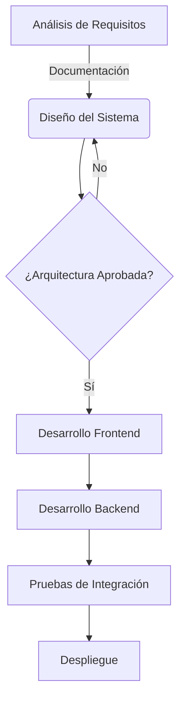
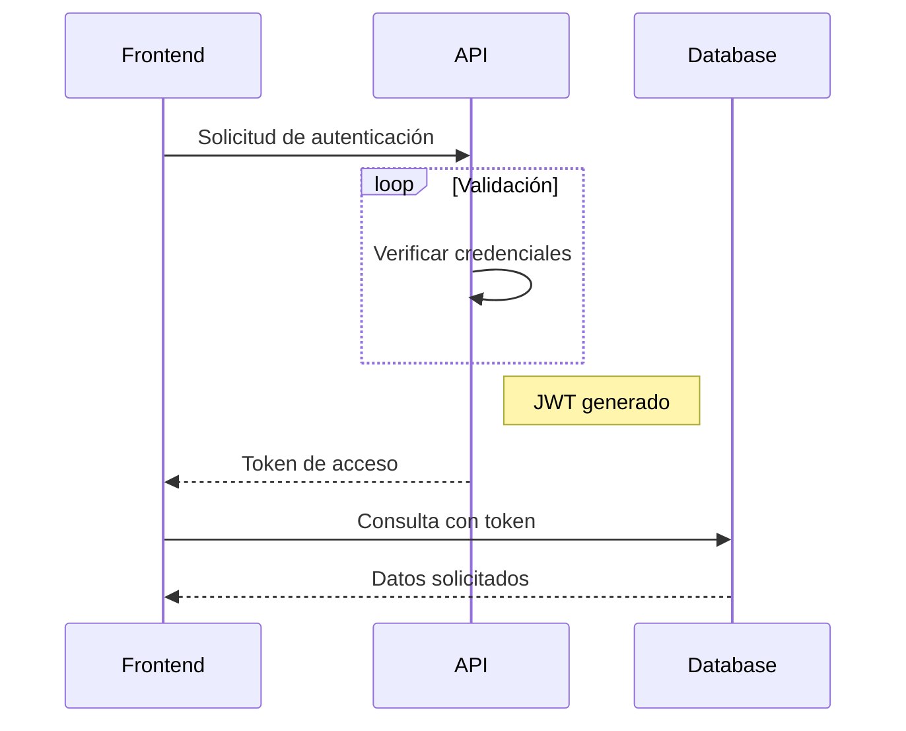
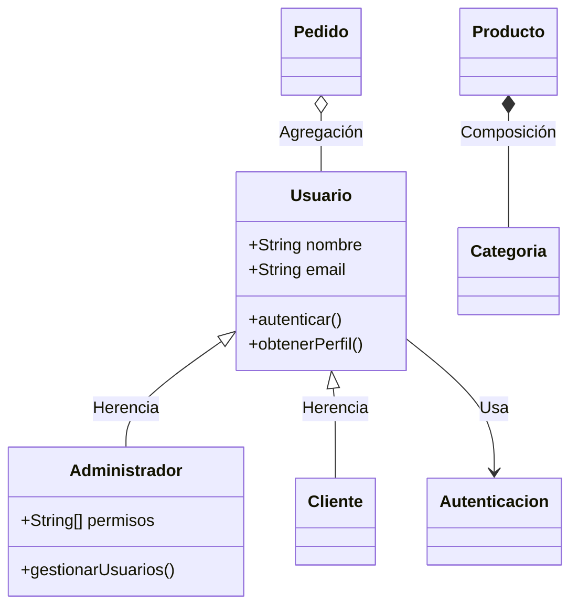

Como estudiante de **Desarrollo de Software en ITLA**, considero que la visualización de datos es una competencia esencial en el mundo tecnológico actual. Hugo Blox me permite integrar perfectamente contenido técnico avanzado, enfocándome en el análisis mientras la plataforma maneja la presentación.

En el mundo del desarrollo de software moderno, las herramientas de visualización son esenciales para comunicar insights de manera efectiva. Utilizo herramientas populares como **Plotly**, **Mermaid** y **frameworks de datos** para crear presentaciones impactantes.

## Gráficos Interactivos con Plotly

Hugo Blox es compatible con el popular formato [Plotly](https://plot.ly/) para visualizaciones de datos interactivas. Con Plotly, ¡puedes diseñar casi cualquier tipo de visualización que puedas imaginar!

Guarda tu JSON de Plotly en la carpeta de tu página, por ejemplo `line-chart.json`, y luego agrega el shortcode `` donde quieras que aparezca el gráfico.

**Demostración:**



También puede ser útil el [Editor JSON de Plotly](http://plotly-json-editor.getforge.io/).

## Diagramas con Mermaid

Hugo Blox es compatible con la extensión _Mermaid_ para diagramas en Markdown. Como estudiante de ITLA, uso estas herramientas para documentar arquitecturas de software y flujos de procesos.

### Diagrama de Flujo para Desarrollo de Software

    ```mermaid
    graph TD
    A[Análisis de Requisitos] -->|Documentación| B(Diseño del Sistema)
    B --> C{¿Arquitectura Aprobada?}
    C -->|Sí| D[Desarrollo Frontend]
    C -->|No| B
    D --> E[Desarrollo Backend]
    E --> F[Pruebas de Integración]
    F --> G[Despliegue]
    ```

se renderiza como:



### Diagrama de Secuencia para APIs

    ```mermaid
    sequenceDiagram
    Frontend->>API: Solicitud de autenticación
    loop Validación
        API->>API: Verificar credenciales
    end
    Note right of API: JWT generado
    API-->>Frontend: Token de acceso
    Frontend->>Database: Consulta con token
    Database-->>Frontend: Datos solicitados
    ```

se renderiza como:



### Diagrama de Clases para Programación Orientada a Objetos

    ```mermaid
    classDiagram
    Usuario <|-- Administrador : Herencia
    Usuario <|-- Cliente : Herencia
    Producto *-- Categoria : Composición
    Pedido o-- Usuario : Agregación
    Usuario --> Autenticacion : Usa
    class Usuario {
        +String nombre
        +String email
        +autenticar()
        +obtenerPerfil()
    }
    class Administrador {
        +String[] permisos
        +gestionarUsuarios()
    }
    ```

se renderiza como:



## Tablas de Datos

Guarda tu hoja de cálculo como un archivo CSV en la carpeta de tu página y luego renderízala agregando el shortcode _Table_ a tu página:

```go

```

se renderiza como:



## Aplicaciones en el Desarrollo de Software

Como estudiante de **Tecnología en Desarrollo de Software en ITLA**, aplico estas herramientas de visualización en:

- 📊 **Análisis de rendimiento** de aplicaciones web
- 🏗️ **Documentación de arquitecturas** de software  
- 📈 **Dashboards de monitoreo** para aplicaciones en producción
- 🔄 **Diagramas de flujo** para metodologías ágiles
- 📋 **Reportes de testing** y métricas de calidad

## Próximos Proyectos

Estoy trabajando en integrar estas visualizaciones en:
- **Dashboards de Business Intelligence** usando Power BI
- **Análisis de datos** con Python y bibliotecas como Pandas y Matplotlib
- **Monitoreo de aplicaciones** en Azure con métricas en tiempo real

---

> *"Los datos son el nuevo petróleo, pero la visualización es la refinería que los convierte en insights valiosos."*

¿Te resultó útil esta página? ¡Considera compartirla! 🙌
