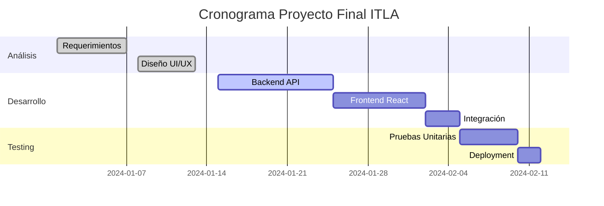

Como estudiante de **Desarrollo de Software en ITLA**, he aprendido que la gestión efectiva de proyectos es crucial para el éxito en el desarrollo de software. Aquí exploro metodologías ágiles, herramientas de planificación y técnicas de organización que aplico en mis proyectos académicos y personales.

## Lluvia de Ideas y Mapas Mentales

Hugo Blox es compatible con una extensión de Markdown para mapas mentales, perfecta para la fase de lluvia de ideas en proyectos de software.

Simplemente inserta un bloque de código Markdown etiquetado como `markmap` y opcionalmente establece la altura del mapa mental como se muestra en el ejemplo.

Los mapas mentales se pueden crear escribiendo los elementos como una lista Markdown dentro del bloque de código `markmap`, indentando cada elemento para crear tantos subniveles como necesites:

<div class="highlight">
<pre class="chroma">
<code>
```markmap {height="200px"}
- Proyecto Web ITLA
  - Frontend (React)
  - Backend (Node.js)
  - Base de Datos (MongoDB)
  - DevOps (Docker)
  - Testing (Jest)
```
</code>
</pre>
</div>

se renderiza como

```markmap {height="200px"}
- Proyecto Web ITLA
  - Frontend (React)
  - Backend (Node.js)
  - Base de Datos (MongoDB)
  - DevOps (Docker)
  - Testing (Jest)
```

## Diagramas de Gantt para Planificación

Hugo Blox es compatible con la extensión _Mermaid_ para diagramas de Gantt, esenciales para la planificación de proyectos de desarrollo de software.

Ejemplo de **diagrama de Gantt**:

    ```mermaid
    gantt
    title Cronograma Proyecto Final ITLA
    dateFormat  YYYY-MM-DD
    section Análisis
    Requerimientos     :done,    req, 2024-01-01,2024-01-07
    Diseño UI/UX      :done,    design, 2024-01-08, 5d
    section Desarrollo
    Backend API       :active,  backend, 2024-01-15, 10d
    Frontend React    :         frontend, after backend, 8d
    Integración       :         integration, after frontend, 3d
    section Testing
    Pruebas Unitarias :         testing, after integration, 5d
    Deployment        :         deploy, after testing, 2d
    ```

se renderiza como



## Listas de Tareas para Metodologías Ágiles

También puedes escribir tus listas de tareas en Markdown, perfectas para seguimiento de sprints en Scrum:

```markdown
- [x] Configurar entorno de desarrollo
  - [x] Instalar Node.js y npm
  - [x] Configurar base de datos
- [x] Desarrollar autenticación de usuarios
- [x] Implementar CRUD básico
- [ ] Agregar validaciones avanzadas
- [ ] Implementar testing automatizado
- [ ] Configurar CI/CD pipeline
```

se renderiza como

- [x] Configurar entorno de desarrollo
  - [x] Instalar Node.js y npm
  - [x] Configurar base de datos
- [x] Desarrollar autenticación de usuarios
- [x] Implementar CRUD básico
- [ ] Agregar validaciones avanzadas
- [ ] Implementar testing automatizado
- [ ] Configurar CI/CD pipeline

## Metodologías Aplicadas en ITLA

Como estudiante de Desarrollo de Software, aplico estas herramientas de gestión en:

- **Scrum**: Para proyectos colaborativos con equipos de estudiantes
- **Kanban**: Para gestión visual del flujo de trabajo
- **DevOps**: Integración de desarrollo y operaciones
- **Control de Versiones**: Usando Git y GitHub para colaboración

## Did you find this page helpful? Consider sharing it 🙌
