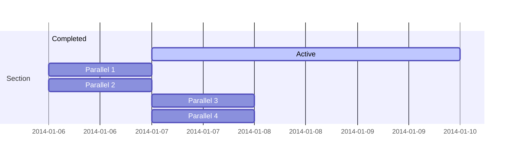

Como estudiante de **Desarrollo de Software en ITLA**, he aprendido que la gestión efectiva de proyectos es crucial para el éxito en el desarrollo de software. Aquí exploro metodologías ágiles, herramientas de planificación y técnicas de organización que aplico en mis proyectos académicos y personales.

## Ideation

Hugo Blox supports a Markdown extension for mindmaps.

Simply insert a Markdown code block labelled as `markmap` and optionally set the height of the mindmap as shown in the example below.

Mindmaps can be created by simply writing the items as a Markdown list within the `markmap` code block, indenting each item to create as many sub-levels as you need:

<div class="highlight">
<pre class="chroma">
<code>
```markmap {height="200px"}
- Hugo Modules
  - Hugo Blox
  - blox-plugins-netlify
  - blox-plugins-netlify-cms
  - blox-plugins-reveal
```
</code>
</pre>
</div>

renders as

```markmap {height="200px"}
- Hugo Modules
  - Hugo Blox
  - blox-plugins-netlify
  - blox-plugins-netlify-cms
  - blox-plugins-reveal
```

## Diagrams

Hugo Blox supports the _Mermaid_ Markdown extension for diagrams.

An example **Gantt diagram**:

    ```mermaid
    gantt
    section Section
    Completed :done,    des1, 2014-01-06,2014-01-08
    Active        :active,  des2, 2014-01-07, 3d
    Parallel 1   :         des3, after des1, 1d
    Parallel 2   :         des4, after des1, 1d
    Parallel 3   :         des5, after des3, 1d
    Parallel 4   :         des6, after des4, 1d
    ```

renders as



## Todo lists

You can even write your todo lists in Markdown too:

```markdown
- [x] Write math example
  - [x] Write diagram example
- [ ] Do something else
```

renders as

- [x] Write math example
  - [x] Write diagram example
- [ ] Do something else

## Did you find this page helpful? Consider sharing it 🙌
